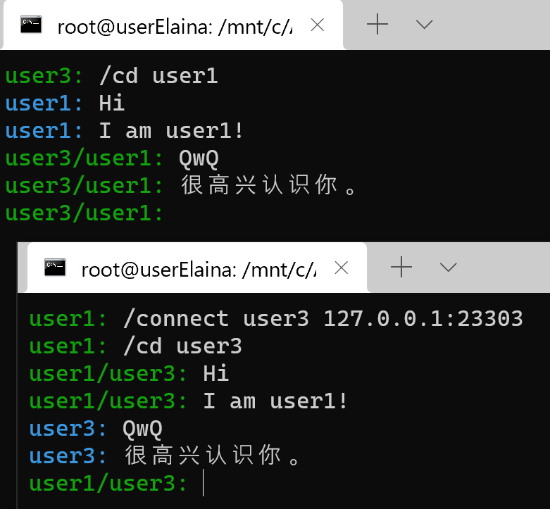

# rsap2p

去中心化端对端加密通信工具.

## 功能

### rsap2p.TCPp2p
进行通信的本体。

#### 定义

```py
TCPp2p(addr:tuple,myname:str,ip:str,pth='./')
```

|名称|类型|解释|
|-|-|-|
|`addr`     |`tuple`|(符合 `socket.socket` 格式的)地址(含端口),如 `0.0.0.0:23333`|
|`myname`   |`str`  |你自己的用户名(尽量不要改变)|
|`ip`       |`str`  |(符合 `socket.socket` 格式的)地址(不含端口),如 `1.1.1.1`|
|`pth`      |`str`  |密钥等文件存储路径|

#### 开始

```py
TCPp2p.start()
```

#### 连接

(主动)建立连接.

```py
TCPp2p.connect(gname:str,gsaddr:tuple=None)->int
```

|名称|类型|解释|
|-|-|-|
|`gname`    |`str`  |想要链接的用户的用户名|
|`gsaddr`   |`tuple`|想要链接的(符合 `socket.socket` 格式的)地址(含端口),如 `1.1.1.1:23333`|
|返回值     |`int`  |详见状态解释|

#### 发送消息

```py
TCPp2p.sendmsg(b:str,name:str)->int
```

|名称|类型|解释|
|-|-|-|
|`b`        |`str`  |想要发送的信息|
|`name`     |`str`  |对方用户名(必须已经(主动或被动)建立链接)|
|返回值     |`int`  |详见状态解释|

#### 接收消息

后台服务监听触发.默认只记录一份log,自定义行为可重载该函数.

```py
TCPp2p.recvmsg(b:bytes,addr:tuple)
```

|名称|类型|解释|
|-|-|-|
|`b`        |`bytes`|收到的信息|
|`addr`     |`tuple`|收到的信息来源地址|
|返回值     |可自定义|可自定义|

#### 关闭连接

主动关闭连接.

```py
TCPp2p.closed(name:str)
```

|名称|类型|解释|
|-|-|-|
|`name`     |`str`      |对方用户名|
|返回值     |`NoneType` |`None`|

### rsap2p.TCPp2p_CUI

#### example
```py
from rsap2p import TCPp2p_CUI
TCPp2p_CUI(('0.0.0.0',23333),'userElaina','127.0.0.1').joins()
```

#### 指令

##### 连接
`/connect username IP:PORT`

##### 给某人发送消息
`/cd username`
之后发送的所有非 `/` 开头的内容均会被发送给此人.

##### 查看当前已连接
`/ls`

##### 关闭连接
`/close username`

#### 效果图


### rsap2p.MySSH
服务端运行 `MySSHServer` 后, 客户端通过 `MySSH ip port name` 连接.